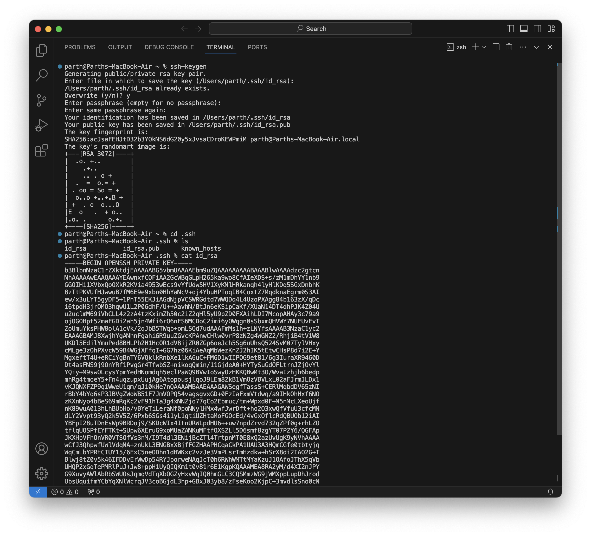
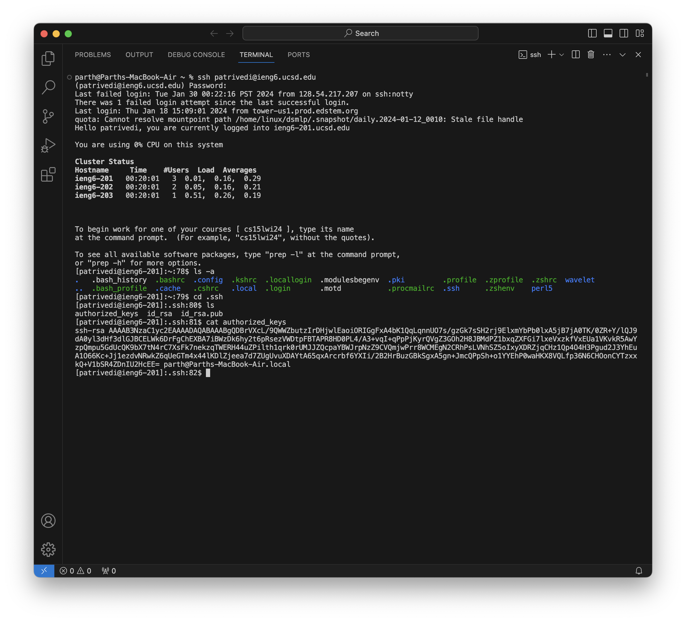

# Lab Report 2
This report shows:
**Part 1** The code for the ChatServer.java file, followed by two screenshots with the ChatServer file in use.
**Part 2** Three screenshots shwoing the pubic key, private key and logging into my `ieng6` account without entering password.
**Part 3** Brief description about the things I have learned in Lab 2 and 3 that I didn't know before.

----
----

## Part 1
## Code for the `ChatServer` file:
```
import java.io.IOException;
import java.net.URI;

class Handler implements URLHandler {
    // The one bit of state on the server: a string that will be manipulated by
    // various requests.
    String retVal = "";

    public String handleRequest(URI url) {
        if (url.getPath().equals("/add-message")) {
            String[] parameters = url.getQuery().split("&");
            String message = parameters[0];
            String user = parameters[1];
            String[] messageArr = message.split("=");
            String[] userArr = user.split("=");
            String messageOut = messageArr[1];
            String userOut = userArr[1];

            retVal = retVal + String.format(userOut + ": " + messageOut + "\n");
            return retVal;
        } 
        return retVal;
    }
}


class ChatServer {
    public static void main(String[] args) throws IOException {
        if(args.length == 0){
            System.out.println("Missing port number! Try any number between 1024 to 49151");
            return;
        }

        int port = Integer.parseInt(args[0]);

        Server.start(port, new Handler());
    }
}


```

---

## Example 1


* For the first screenshot both the main method and handleRequest method are called for starting the server and url arguments respectively.
* For the main method the argument is the port number after the files has been compiled and are being executed, in this example the argument (port number) was 999. For the handleRequest method the argument was the url of the server, inside the method we first check if path of the url contains `"/add-message"` string. Then we split the string thrice to get different components for our output.
* The value of the different arrays change based on the url in this case `/add-message?s=Hello&user=jpolitz`, the `parameters` string array changes to `{s=Hello, user=jpolitz}`. The string  `message` has value `"s=Hello"`, the string `user` has value `"user=jpolitz"`. The string array `messageArr` has value `{s,Hello}` and the string array `userArr` has value `{user,jpolitz}`. The string `messageOut` has the value `"Hello"` and the string `userOut` has the value `"jpolitz"`. The return string `retVal` will have the value `"jpolitz: Hello
"`. 


---

## Example 2


* For the second screenshot only the handleRequest method will be called because we have already started the server which uses the main method in the first screenshot.
* With this example we are not compiling or executing the files, we are only updating the value of the url. For the handleRequest method the argument was the url of the server, inside the method we first check if path of the url contains `"/add-message"` string. Then we split the string thrice to get different components for our output and update the values of variables we have defined before.
* The value of the different arrays change based on the url in this case `/add-message?s=How are you&user=yash`, the `parameters` string array changes to `{s=How are you, user=yash}`. The string  `message` has value `"s=How are you"`, the string `user` has value `"user=yash"`. The string array `messageArr` has value `{s,How are you}` and the string array `userArr` has value `{user,yash}`. The string `messageOut` has the value `"How are you"` and the string `userOut` has the value `"yash"`. The return string `retVal` will have the value
  
 `"jpolitz: Hello`

`yash: How are you"` because it is concatinating the two outputs together, separated by a new line.

---
---

## Part 2

>The absolute path to the private key for my SSH key for logging into my `ieng6` account `patrivedi@ieng6.ucsd.edu` is `/Users/parth/.ssh/ud_rsa`

---


>The absolute path to the public key for your SSH key for logging into `ieng6` account `patrivedi@ieng6.ucsd.edu` is `/home/linux/ieng6/oce/90/patrivedi/.ssh/authorized_keys`

---


>Screenshot for logging into my `ieng6` account `patrivedi@ieng6.ucsd.edu` wihtout using the password.

---
---

## Part 3

I learned a lot of things in week 2 and 3 that I did not know before, like the different parts of a url, different terminal commands and their use, how to start a remote server and access it, how we can manipulate the url of a server to get different results and construct a code for the desired affect we want in a server.

 
